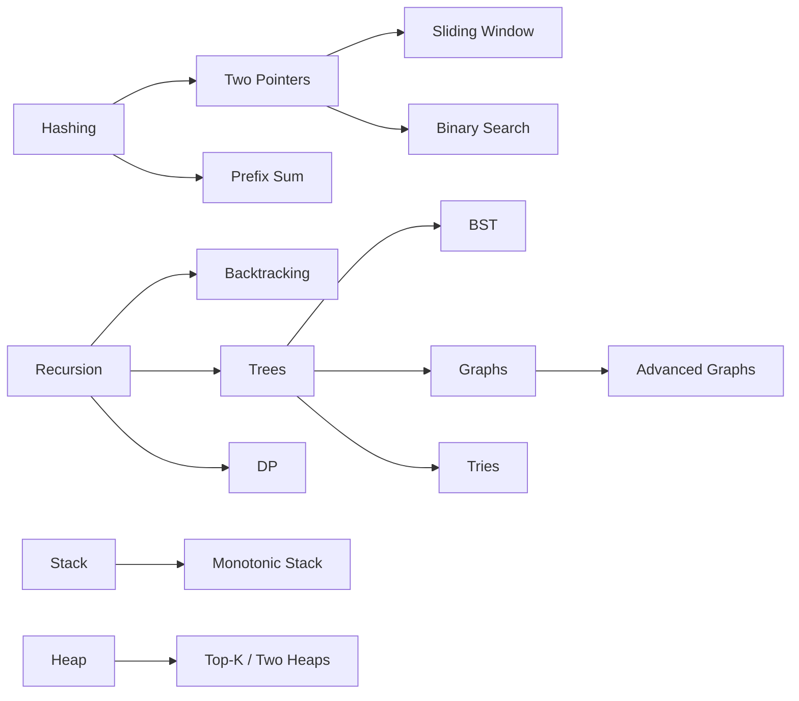

# ULTIMATE DSA VISUAL NOTES

> The single map for the whole sheet. Cross-checked against
> **Striver A2Z** (takeuforward.org) and **AlgoMaster DSA Patterns** (algomaster.io).
>
> Mermaid diagrams render on GitHub and in VS Code (with a Mermaid preview
> extension). If a diagram shows as code, install "Markdown Preview Mermaid Support".
>
> Company tags throughout are *commonly reported* associations, not official data.

---

## Legend

- Difficulty:  Easy = E   Medium = M   Hard = H
- Frequency:  ***** very high  |  **** high  |  *** medium
- Covered:  [x] has pattern notes   [ ] not yet

---

## 1. Coverage Matrix (AlgoMaster 15 Patterns)

| # | AlgoMaster Pattern | Covered | Where |
|---|--------------------|---------|-------|
| 1 | Prefix Sum | [x] | `PrefixSumPattern/Prefix Sum Pattern` |
| 2 | Two Pointers | [x] | `SlidingWindowAndTwoPointers/Two Pointers Pattern` |
| 3 | Sliding Window | [x] | `SlidingWindowAndTwoPointers/Sliding Window Pattern` |
| 4 | Fast & Slow Pointers | [x] | `LinkedList/Linked List Pattern/Fast_Slow_Pointer_Patterns.md` |
| 5 | LinkedList In-place Reversal | [x] | `LinkedList/Linked List Pattern/Reversal_Patterns.md` |
| 6 | Monotonic Stack | [x] | `StackAndQueue/Stack Pattern/Monotonic_Stack_Patterns.md` |
| 7 | Top 'K' Elements | [x] | `Heap/Heap Pattern/Top_K_Patterns.md` |
| 8 | Overlapping Intervals | [x] | `Intervals/Intervals Pattern` |
| 9 | Modified Binary Search | [x] | `BinarySearch/Binary Search Pattern` |
| 10 | Binary Tree Traversal | [x] | `BinaryTrees/Trees Pattern` |
| 11 | Depth-First Search (DFS) | [x] | `Graphs/Graph Pattern` + `Trees Pattern` |
| 12 | Breadth-First Search (BFS) | [x] | `Graphs/Graph Pattern` + `Trees Pattern` |
| 13 | Matrix Traversal | [x] | `Graphs` (Matrix DFS/BFS) + `Math And Geometry` |
| 14 | Backtracking | [x] | `Recursion/Backtracking Pattern` |
| 15 | Dynamic Programming | [x] | `DynamicProgramming/DP Pattern` |

All 15 AlgoMaster patterns: **covered.**

---

## 2. Coverage Matrix (Striver A2Z Steps)

| Striver Step | Covered | Where |
|--------------|---------|-------|
| Basics / Recursion | [x] | `Recursion/Backtracking Pattern` |
| Sorting | [x] | `SortingTechniques/Sorting Pattern` |
| Arrays / Hashing | [x] | `Arrays/Arrays & Hashing Pattern` |
| Binary Search | [x] | `BinarySearch/Binary Search Pattern` |
| Strings | [x] | `String/String Pattern` |
| Linked List | [x] | `LinkedList/Linked List Pattern` |
| Bit Manipulation | [x] | `BitManipulation/Bit Manipulation Pattern` |
| Stack & Queue | [x] | `StackAndQueue/Stack Pattern` |
| Sliding Window & Two Pointer | [x] | `SlidingWindowAndTwoPointers/*` |
| Heaps | [x] | `Heap/Heap Pattern` |
| Greedy | [x] | `GreedyAlgorithms/Greedy Pattern` |
| Binary Trees & BST | [x] | `BinaryTrees/Trees Pattern` |
| Graphs (+ Advanced) | [x] | `Graphs/Graph Pattern` |
| Dynamic Programming | [x] | `DynamicProgramming/DP Pattern` |
| Tries | [x] | `Tries/Tries Pattern` |
| Intervals | [x] | `Intervals/Intervals Pattern` |
| Math & Geometry | [x] | `Math And Geometry/Math And Geometry Pattern` |

Striver A2Z topics: **covered.**

---

## 3. THE MEGA DECISION TREE — "Which pattern do I use?"

```mermaid
flowchart TD
    START([Read problem & list keywords]) --> DS{Data structure?}

    DS -->|Array / String| ARR{What is asked?}
    DS -->|Linked List| LL{What is asked?}
    DS -->|Tree| TR{What is asked?}
    DS -->|Graph / Grid| GR{What is asked?}
    DS -->|Intervals| IV[Overlapping Intervals]

    ARR -->|contiguous subarray sum/range| PS[Prefix Sum]
    ARR -->|longest/shortest window w/ constraint| SW[Sliding Window]
    ARR -->|sorted + pair / in-place| TP[Two Pointers]
    ARR -->|search in sorted / min feasible| BS[Modified Binary Search]
    ARR -->|top / kth / most frequent| TK[Top K - Heap]
    ARR -->|next greater / smaller| MS[Monotonic Stack]
    ARR -->|all subsets/perms/combos| BT[Backtracking]
    ARR -->|optimize / count ways| DP[Dynamic Programming]
    ARR -->|seen? / frequency / group| HA[Hashing]

    LL -->|cycle / middle / nth-end| FS[Fast and Slow Pointers]
    LL -->|reverse / reorder| RV[In-place Reversal]
    LL -->|merge / build| DH[Dummy Head]

    TR -->|per level| BFS[Tree BFS]
    TR -->|height/path/diameter| DFS[Tree DFS]
    TR -->|ordered / kth / range| BST[BST logic]

    GR -->|explore whole region| GDFS[DFS / Flood Fill]
    GR -->|shortest / min moves| GBFS[BFS]
    GR -->|weighted shortest path| DIJ[Dijkstra]
    GR -->|negative weights| BF[Bellman-Ford]
    GR -->|connect all cheaply| MST[MST Prim/Kruskal]
    GR -->|prerequisites / order| TS[Topological Sort]
    GR -->|same group / merge| DSU[Union-Find]
```



---

## 4. Keyword -> Pattern (fast lookup)

| Keyword in problem | Pattern |
|--------------------|---------|
| "subarray sum", "range sum" | Prefix Sum |
| "longest/shortest substring", "at most K" | Sliding Window |
| "sorted", "pair", "palindrome", "in place" | Two Pointers |
| "cycle", "middle", "nth from end" | Fast & Slow |
| "reverse the list", "k-group" | LinkedList Reversal |
| "next greater", "daily temperatures", "histogram" | Monotonic Stack |
| "kth largest", "top k", "k closest", "median" | Heap |
| "merge intervals", "meeting rooms" | Intervals |
| "search sorted", "minimize max", "rotated" | Binary Search |
| "level order", "right side view" | Tree BFS |
| "prerequisite", "build order", "A before B" | Topological Sort |
| "connect all", "min wiring cost" | MST |
| "cheapest/fastest path", weighted | Dijkstra |
| "same component", "friend circle" | Union-Find |
| "all subsets/permutations/combinations" | Backtracking |
| "number of ways", "min/max cost", "longest" | Dynamic Programming |
| "anagram", "frequency", "group" | Hashing |

---

## 5. Master Complexity Cheat Sheet

```
        FASTER  <-------------------------------------------->  SLOWER
        O(1)  O(log n)  O(n)  O(n log n)  O(n^2)  O(2^n)  O(n!)
        hash   binary    scan   sort/heap  nested   subset  perms
        lookup  search   window            DP-2D    backtr  backtr
```

| Pattern | Typical Time | Typical Space |
|---------|--------------|---------------|
| Prefix Sum | O(n) build, O(1) query | O(n) |
| Two Pointers | O(n) | O(1) |
| Sliding Window | O(n) | O(k) |
| Fast & Slow | O(n) | O(1) |
| Binary Search | O(log n) | O(1) |
| Monotonic Stack | O(n) | O(n) |
| Heap Top-K | O(n log k) | O(k) |
| Tree DFS/BFS | O(n) | O(h) / O(w) |
| Graph DFS/BFS | O(V+E) | O(V) |
| Dijkstra | O(E log V) | O(V) |
| Union-Find | ~O(alpha) | O(V) |
| Backtracking | O(2^n)/O(n!) | O(n) |
| DP | O(states x transition) | O(states) |

---

## 6. Company Frequency Heatmap (commonly reported)

| Pattern | Amazon | Google | Meta | Microsoft |
|---------|--------|--------|------|-----------|
| Hashing / Two Sum | ***** | ***** | ***** | **** |
| Sliding Window | **** | **** | ***** | *** |
| Two Pointers | **** | **** | ***** | *** |
| Binary Search | **** | ***** | *** | **** |
| Trees (DFS/BFS) | **** | **** | ***** | **** |
| Graphs (BFS/DFS/Dijkstra) | **** | ***** | **** | *** |
| Heap / Top-K | ***** | **** | *** | *** |
| Intervals | **** | **** | **** | *** |
| Backtracking | *** | **** | **** | *** |
| Dynamic Programming | **** | ***** | **** | **** |
| Monotonic Stack | *** | **** | **** | *** |
| Linked List | **** | *** | **** | **** |

Read as: how often this pattern shows up in that company's loops (directional, not exact).

---

## 7. Suggested Revision Order (dependency-aware)



Recommended sequence: Hashing -> Two Pointers -> Sliding Window -> Prefix Sum ->
Binary Search -> Stack -> Linked List -> Recursion/Backtracking -> Trees -> BST ->
Heap -> Greedy -> Intervals -> Graphs -> Advanced Graphs -> DP -> Tries ->
Bit Manipulation -> Math & Geometry.

---

## 8. Full Topic Index (open the master file in each)

| Topic | Master File |
|-------|-------------|
| Arrays & Hashing | `Arrays/Arrays & Hashing Pattern/00_Arrays_Hashing_Master.md` |
| Prefix Sum | `PrefixSumPattern/Prefix Sum Pattern/00_Prefix_Sum_Master.md` |
| Two Pointers | `SlidingWindowAndTwoPointers/Two Pointers Pattern/00_Two_Pointers_Master.md` |
| Sliding Window | `SlidingWindowAndTwoPointers/Sliding Window Pattern/00_Sliding_Window_Master.md` |
| Binary Search | `BinarySearch/Binary Search Pattern/00_Binary_Search_Master.md` |
| Sorting | `SortingTechniques/Sorting Pattern/00_Sorting_Master.md` |
| Strings | `String/String Pattern/00_String_Master.md` |
| Linked List | `LinkedList/Linked List Pattern/00_Linked_List_Master.md` |
| Stack | `StackAndQueue/Stack Pattern/00_Stack_Master.md` |
| Trees & BST | `BinaryTrees/Trees Pattern/00_Trees_Master.md` |
| Heap | `Heap/Heap Pattern/00_Heap_Master.md` |
| Backtracking | `Recursion/Backtracking Pattern/00_Backtracking_Master.md` |
| Greedy | `GreedyAlgorithms/Greedy Pattern/00_Greedy_Master.md` |
| Intervals | `Intervals/Intervals Pattern/00_Intervals_Master.md` |
| Graphs | `Graphs/Graph Pattern/00_Graph_Revision_Master.md` |
| Dynamic Programming | `DynamicProgramming/DP Pattern/00_DP_Master.md` |
| Tries | `Tries/Tries Pattern/00_Tries_Master.md` |
| Bit Manipulation | `BitManipulation/Bit Manipulation Pattern/00_Bit_Manipulation_Master.md` |
| Math & Geometry | `Math And Geometry/Math And Geometry Pattern/00_Math_Geometry_Master.md` |

---

## 9. The 60-Second Pre-Interview Refresher

1. Sorted array + target? -> **Binary Search / Two Pointers**.
2. Contiguous window + constraint? -> **Sliding Window**.
3. Subarray sum = k? -> **Prefix Sum + HashMap**.
4. Next greater/smaller? -> **Monotonic Stack**.
5. Kth / top-k / median? -> **Heap**.
6. Grid explore vs shortest? -> **DFS vs BFS**.
7. Weighted shortest path? -> **Dijkstra** (neg -> Bellman-Ford).
8. Connect all cheaply? -> **MST**.
9. Order with prerequisites? -> **Topological Sort**.
10. Same group / merge? -> **Union-Find**.
11. All arrangements? -> **Backtracking**.
12. Count ways / optimize? -> **DP** (define state first).
```
