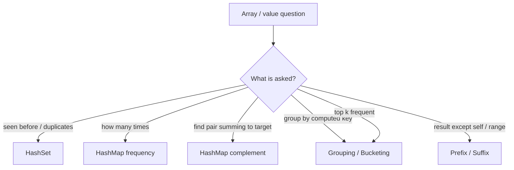

# Arrays & Hashing - Master Revision Note

Based on the NeetCode roadmap "Arrays & Hashing" topic.
Start at the Decision Table, identify the pattern, open the matching file.

> Company tags are *commonly reported* associations (from LeetCode company
> lists / interview reports), not official live data.

---

## Visual Decision Tree

---

## Master Decision Table

| If the problem asks for...                                    | Pattern / File |
|---------------------------------------------------------------|----------------|
| "Any duplicates?", "seen before?", membership check           | [HashSet_Frequency_Patterns](./HashSet_Frequency_Patterns.md) |
| Count occurrences, anagram, frequency of chars/nums           | [HashSet_Frequency_Patterns](./HashSet_Frequency_Patterns.md) |
| "Find two/three items that sum to X", complement lookup       | [HashMap_Lookup_Patterns](./HashMap_Lookup_Patterns.md) |
| Group / bucket items by a computed key                        | [Grouping_Bucketing_Patterns](./Grouping_Bucketing_Patterns.md) |
| Top-K frequent, K most/least common                           | [Grouping_Bucketing_Patterns](./Grouping_Bucketing_Patterns.md) |
| Product/sum of all elements except self, running totals       | [Prefix_Product_Patterns](./Prefix_Product_Patterns.md) |
| Longest consecutive run of numbers                            | [HashSet_Frequency_Patterns](./HashSet_Frequency_Patterns.md) |

---

## Core Mental Triggers

- **"Have I seen this before?"** -> `HashSet`.
- **"How many times?"** -> `HashMap<key, count>`.
- **"Find the pair/complement"** -> `HashMap<value, index>`.
- **"Group these together"** -> `HashMap<key, List>` (sorted string, char count, etc.).
- **"Except itself" / running total** -> prefix / suffix arrays.

---

## Complexity Cheat Sheet

| Technique             | Time      | Space |
|-----------------------|-----------|-------|
| HashSet membership    | O(n)      | O(n)  |
| HashMap frequency     | O(n)      | O(n)  |
| Two Sum (hashmap)     | O(n)      | O(n)  |
| Group Anagrams        | O(n*k)    | O(n*k)|
| Top-K (bucket sort)   | O(n)      | O(n)  |
| Prefix product        | O(n)      | O(1)* |

*O(1) extra if the output array doesn't count.

---

## Files in this folder

1. `HashSet_Frequency_Patterns.md`
2. `HashMap_Lookup_Patterns.md`
3. `Grouping_Bucketing_Patterns.md`
4. `Prefix_Product_Patterns.md`
