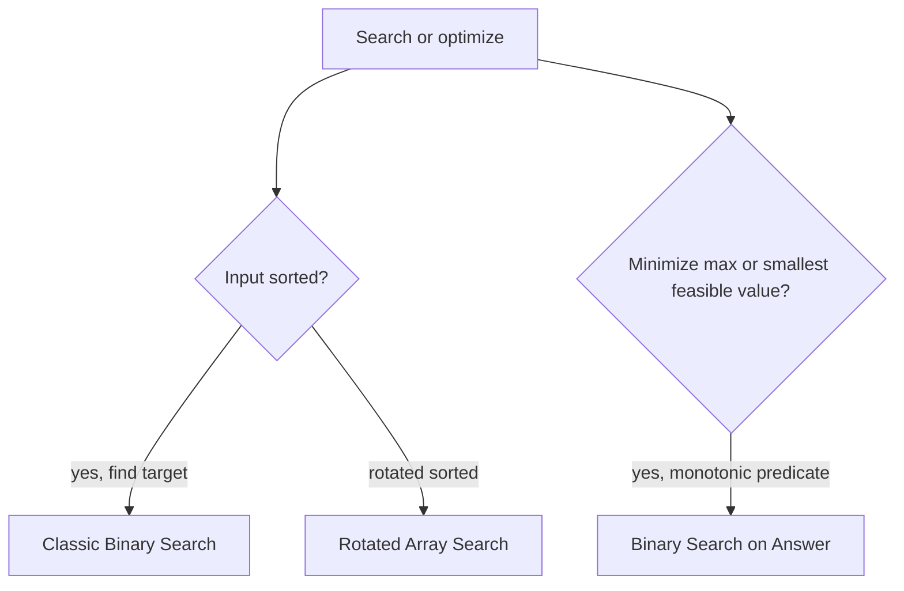

# Binary Search - Master Revision Note

Based on the NeetCode roadmap "Binary Search" topic.

> Company tags are *commonly reported* associations, not official live data.

---

## Visual Decision Tree



---

## Master Decision Table

| If the problem asks for...                                       | Pattern / File |
|------------------------------------------------------------------|----------------|
| Find target / insert position in a sorted array                  | [Classic_Binary_Search](./Classic_Binary_Search.md) |
| Sorted but rotated array search                                  | [Rotated_Array_Patterns](./Rotated_Array_Patterns.md) |
| Find min / find element in rotated array                         | [Rotated_Array_Patterns](./Rotated_Array_Patterns.md) |
| "Minimum capacity/speed/days so that ..." (min feasible value)   | [Binary_Search_On_Answer](./Binary_Search_On_Answer.md) |
| Search a 2D sorted matrix                                        | [Classic_Binary_Search](./Classic_Binary_Search.md) |
| Median of two sorted arrays / kth element                        | [Binary_Search_On_Answer](./Binary_Search_On_Answer.md) |

---

## Core Mental Triggers

- **Sorted input + O(log n) expected** -> binary search.
- **"Minimize the maximum" / "maximize the minimum" / "smallest X that works"** -> binary search on the answer.
- **Monotonic predicate** (`false...false, true...true`) -> find the boundary.

---

## Two Templates You Must Know

**Find exact target**

```java
int lo = 0, hi = n - 1;
while (lo <= hi) {
    int mid = lo + (hi - lo) / 2;
    if (a[mid] == target) return mid;
    if (a[mid] < target) lo = mid + 1;
    else hi = mid - 1;
}
return -1;
```

**Find first index where predicate is true (lower bound)**

```java
int lo = 0, hi = n;              // hi exclusive
while (lo < hi) {
    int mid = lo + (hi - lo) / 2;
    if (predicate(mid)) hi = mid;
    else lo = mid + 1;
}
return lo;                       // first index that satisfies predicate
```

---

## Files in this folder

1. `Classic_Binary_Search.md`
2. `Rotated_Array_Patterns.md`
3. `Binary_Search_On_Answer.md`
