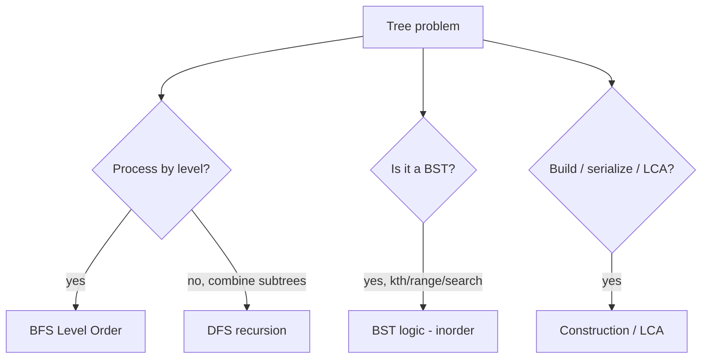

# Trees - Master Revision Note

Covers NeetCode roadmap "Trees" (Binary Tree + BST).

> Company tags are *commonly reported* associations, not official live data.

---

## TreeNode definition (used in all files)

```java
class TreeNode {
    int val;
    TreeNode left, right;
    TreeNode(int val) { this.val = val; }
}
```

---

## Visual Decision Tree



---

## Master Decision Table

| If the problem asks for...                                     | Pattern / File |
|----------------------------------------------------------------|----------------|
| Height, diameter, path sums, "info from children"              | [DFS_Traversal_Patterns](./DFS_Traversal_Patterns.md) |
| Inorder/preorder/postorder, validate BST via inorder           | [DFS_Traversal_Patterns](./DFS_Traversal_Patterns.md) |
| Level order, right-side view, zigzag, min depth                | [BFS_LevelOrder_Patterns](./BFS_LevelOrder_Patterns.md) |
| Search/insert/delete/kth in a BST, ordered operations          | [BST_Patterns](./BST_Patterns.md) |
| Build tree from traversals, serialize, LCA                     | [Construction_LCA_Patterns](./Construction_LCA_Patterns.md) |

---

## Core Mental Triggers

- **"Compute something using left & right subtree results"** -> post-order DFS returning a value.
- **"Level by level" / "each level"** -> BFS queue.
- **BST + "kth" / "range" / "closest"** -> inorder gives sorted order.
- **"Lowest common ancestor"** -> recursive DFS returning found nodes.

---

## The Two Skeletons

**DFS (recursion)**

```java
int dfs(TreeNode node) {
    if (node == null) return 0;      // base
    int l = dfs(node.left);
    int r = dfs(node.right);
    return combine(l, r, node.val);  // post-order combine
}
```

**BFS (level order)**

```java
Queue<TreeNode> q = new LinkedList<>();
q.offer(root);
while (!q.isEmpty()) {
    int size = q.size();             // fix the level boundary
    for (int i = 0; i < size; i++) {
        TreeNode n = q.poll();
        if (n.left != null) q.offer(n.left);
        if (n.right != null) q.offer(n.right);
    }
}
```

---

## Files in this folder

1. `DFS_Traversal_Patterns.md`
2. `BFS_LevelOrder_Patterns.md`
3. `BST_Patterns.md`
4. `Construction_LCA_Patterns.md`
