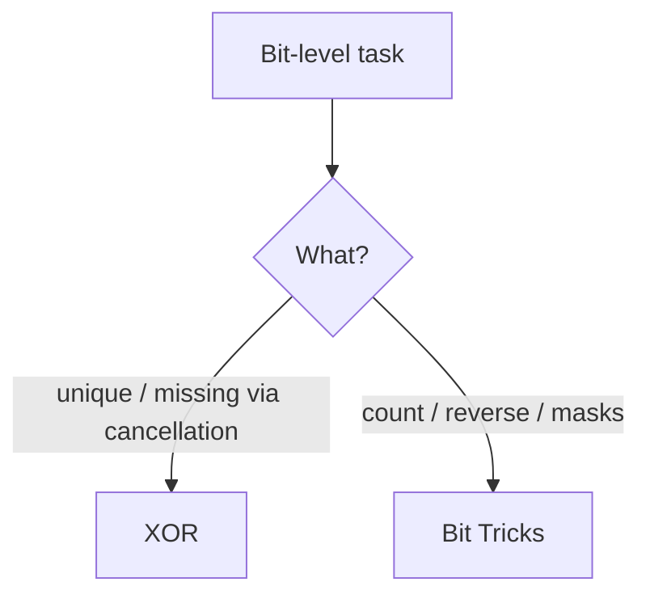

# Bit Manipulation - Master Revision Note

Based on the NeetCode roadmap "Bit Manipulation" topic.

> Company tags are *commonly reported* associations, not official live data.

---

## Essential bit tricks (memorize)

| Goal | Expression |
|------|-----------|
| Check bit i is set | `(x >> i) & 1` |
| Set bit i | `x \| (1 << i)` |
| Clear bit i | `x & ~(1 << i)` |
| Toggle bit i | `x ^ (1 << i)` |
| Lowest set bit | `x & (-x)` |
| Remove lowest set bit | `x & (x - 1)` |
| Is power of two | `x > 0 && (x & (x - 1)) == 0` |
| XOR identity | `a ^ a = 0`, `a ^ 0 = a` |

---

## Visual Decision Tree

---

## Master Decision Table

| If the problem asks for...                                   | Pattern / File |
|--------------------------------------------------------------|----------------|
| Find the unique / missing number using XOR                   | [XOR_Patterns](./XOR_Patterns.md) |
| Count bits, swap, reverse, power-of-two checks               | [Bit_Tricks_Patterns](./Bit_Tricks_Patterns.md) |

---

## Files in this folder

1. `XOR_Patterns.md`
2. `Bit_Tricks_Patterns.md`
