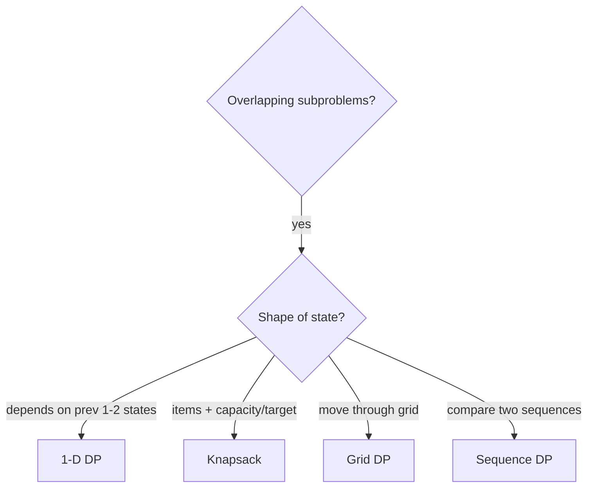

# Dynamic Programming - Master Revision Note

Covers NeetCode roadmap "1-D DP" and "2-D DP".

> Company tags are *commonly reported* associations, not official live data.

---

## How to recognise DP

Ask:
1. Are there **overlapping subproblems** (same computation repeats)?
2. Is there **optimal substructure** (answer built from sub-answers)?
3. Words like **"number of ways"**, **"min/max cost"**, **"longest/shortest"**, **"can we reach/partition"**?

If YES -> DP. Then pick the sub-pattern below.

---

## Visual Decision Tree



---

## Master Decision Table

| If the problem looks like...                                 | Pattern / File |
|--------------------------------------------------------------|----------------|
| Depends on previous 1-2 states (stairs, robber, decode)      | [1D_DP_Patterns](./1D_DP_Patterns.md) |
| Pick/skip items with a capacity/target (subset, coins)       | [Knapsack_Patterns](./Knapsack_Patterns.md) |
| Move through a grid (paths, min sum)                         | [Grid_DP_Patterns](./Grid_DP_Patterns.md) |
| Compare/transform two sequences (LCS, edit distance, LIS)    | [Sequence_DP_Patterns](./Sequence_DP_Patterns.md) |

---

## The 5-Step DP Recipe

1. **State:** what does `dp[i]` / `dp[i][j]` mean (in words)?
2. **Transition:** how does it depend on smaller states?
3. **Base case(s).**
4. **Order:** iterate so dependencies are ready (or memoize top-down).
5. **Answer:** which cell holds it? Can space be reduced to O(1)/O(n)?

---

## Top-Down (memo) skeleton

```java
Integer[] memo;
int solve(int i) {
    if (baseCase) return baseValue;
    if (memo[i] != null) return memo[i];
    int ans = combine(solve(i - 1), solve(i - 2));
    return memo[i] = ans;
}
```

---

## Files in this folder

1. `1D_DP_Patterns.md`
2. `Knapsack_Patterns.md`
3. `Grid_DP_Patterns.md`
4. `Sequence_DP_Patterns.md`
