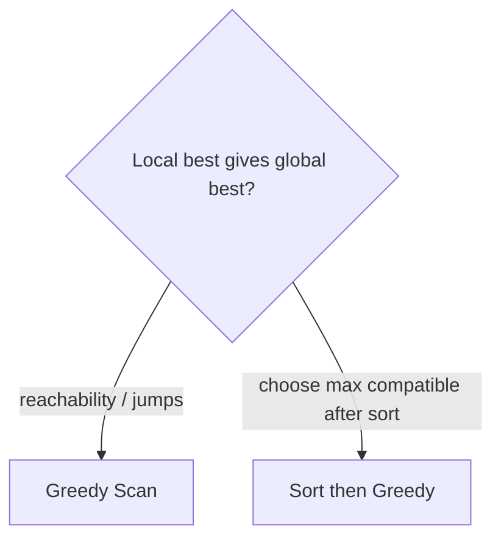

# Greedy - Master Revision Note

Based on the NeetCode roadmap "Greedy" topic.

> Company tags are *commonly reported* associations, not official live data.

---

## How to recognise Greedy

- A locally optimal choice (largest/smallest/earliest) leads to a global optimum.
- "Maximum/minimum" where sorting or a running best suffices.
- No need to reconsider past choices (unlike DP).

**Caution:** greedy only works if the greedy-choice property holds. When in doubt,
compare against a DP solution on small cases.

---

## Visual Decision Tree

---

## Master Decision Table

| If the problem asks for...                                   | Pattern / File |
|--------------------------------------------------------------|----------------|
| Reachability / jumps / max running value on an array         | [Greedy_Scan_Patterns](./Greedy_Scan_Patterns.md) |
| Choose/sort by a key then take greedily (intervals, tasks)   | [Sort_Then_Greedy_Patterns](./Sort_Then_Greedy_Patterns.md) |

---

## Core Mental Triggers

- **"Can I reach the end / min jumps"** -> track farthest reachable.
- **"Max subarray / max profit repeatedly"** -> running greedy.
- **"Pick max compatible items"** -> sort, then greedily select.

---

## Files in this folder

1. `Greedy_Scan_Patterns.md`
2. `Sort_Then_Greedy_Patterns.md`
