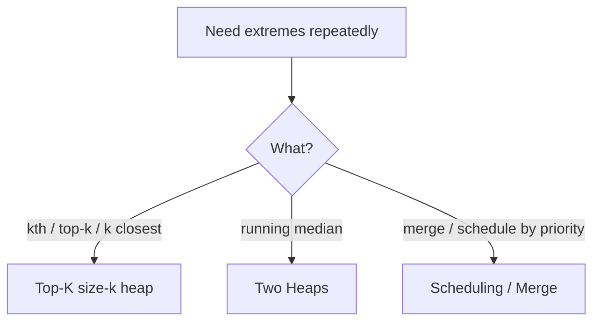

# Heap / Priority Queue - Master Revision Note

Based on the NeetCode roadmap "Heap / Priority Queue" topic.

> Company tags are *commonly reported* associations, not official live data.

---

## How to recognise a Heap problem

- "Kth largest/smallest", "top K", "K closest".
- "Median of a stream", "running/continuous".
- "Merge K sorted", "schedule by priority", "most frequent".
- You need the min or max repeatedly, but not full sorting.

---

## Visual Decision Tree



---

## Master Decision Table

| If the problem asks for...                                   | Pattern / File |
|--------------------------------------------------------------|----------------|
| Kth largest/smallest, top K, K closest points               | [Top_K_Patterns](./Top_K_Patterns.md) |
| Median of a data stream, balance two halves                 | [Two_Heaps_Patterns](./Two_Heaps_Patterns.md) |
| Schedule tasks / merge streams by priority                  | [Scheduling_Merge_Patterns](./Scheduling_Merge_Patterns.md) |

---

## PriorityQueue basics (Java)

```java
PriorityQueue<Integer> minHeap = new PriorityQueue<>();                 // min at top
PriorityQueue<Integer> maxHeap = new PriorityQueue<>((a,b) -> b - a);   // max at top
// custom object:
PriorityQueue<int[]> pq = new PriorityQueue<>((a,b) -> a[0] - b[0]);
```

- `offer`/`poll`/`peek` are O(log n); `peek` is O(1).
- For **K largest**, keep a **min-heap of size K** (poll when size > K).

---

## Files in this folder

1. `Top_K_Patterns.md`
2. `Two_Heaps_Patterns.md`
3. `Scheduling_Merge_Patterns.md`
