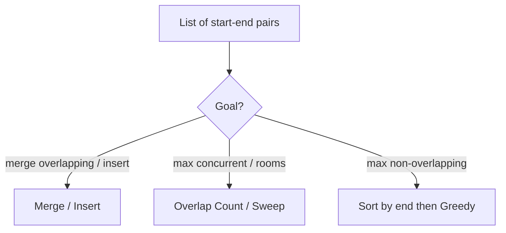

# Intervals - Master Revision Note

Based on the NeetCode roadmap "Intervals" topic.
(This is a NEW topic folder — NeetCode lists Intervals separately.)

> Company tags are *commonly reported* associations, not official live data.

---

## How to recognise Interval problems

- Input is a list of `[start, end]` pairs.
- Words: "merge", "overlap", "insert", "meeting rooms", "conflict".
- Almost always the first step is **sort by start (or end)**.

---

## Visual Decision Tree

---

## Master Decision Table

| If the problem asks for...                                    | Pattern / File |
|---------------------------------------------------------------|----------------|
| Merge overlapping / insert a new interval                     | [Merge_Insert_Patterns](./Merge_Insert_Patterns.md) |
| Count rooms/resources / max concurrent overlaps               | [Overlap_Count_Patterns](./Overlap_Count_Patterns.md) |
| Max non-overlapping / min removals                            | See Greedy `Sort_Then_Greedy_Patterns.md` |

---

## The two sort keys

- **Sort by start** -> merging, inserting.
- **Sort by end** -> greedily keep max non-overlapping (see Greedy notes).
- **Sweep line / two sorted arrays of starts & ends** -> count concurrent overlaps.

---

## Files in this folder

1. `Merge_Insert_Patterns.md`
2. `Overlap_Count_Patterns.md`
