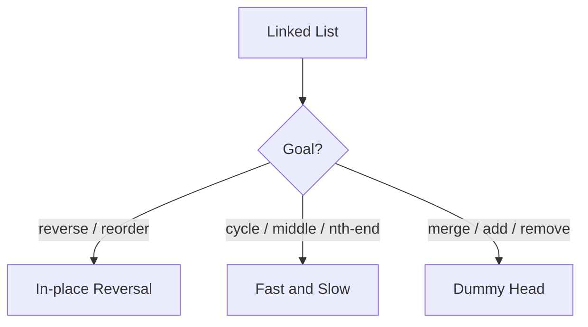

# Linked List - Master Revision Note

Based on the NeetCode roadmap "Linked List" topic.

> Company tags are *commonly reported* associations, not official live data.

---

## ListNode definition (used in all files)

```java
class ListNode {
    int val;
    ListNode next;
    ListNode(int val) { this.val = val; }
}
```

---

## Visual Decision Tree



---

## Master Decision Table

| If the problem asks for...                                     | Pattern / File |
|----------------------------------------------------------------|----------------|
| Reverse a list / reorder / swap nodes                          | [Reversal_Patterns](./Reversal_Patterns.md) |
| Detect cycle, find middle, nth from end                        | [Fast_Slow_Pointer_Patterns](./Fast_Slow_Pointer_Patterns.md) |
| Merge lists, add numbers, remove nodes (dummy head)            | [Dummy_And_Merge_Patterns](./Dummy_And_Merge_Patterns.md) |

---

## Core Mental Triggers

- **Reverse / reorder** -> three-pointer reversal (prev, cur, next).
- **Cycle / middle / kth-from-end** -> fast & slow pointers.
- **Building/merging a new list** -> dummy head + tail pointer.

---

## Two skeletons

**Iterative reversal**

```java
ListNode prev = null, cur = head;
while (cur != null) {
    ListNode next = cur.next;
    cur.next = prev;
    prev = cur;
    cur = next;
}
return prev;
```

**Dummy head build**

```java
ListNode dummy = new ListNode(0), tail = dummy;
// tail.next = ...; tail = tail.next;
return dummy.next;
```

---

## Files in this folder

1. `Reversal_Patterns.md`
2. `Fast_Slow_Pointer_Patterns.md`
3. `Dummy_And_Merge_Patterns.md`
