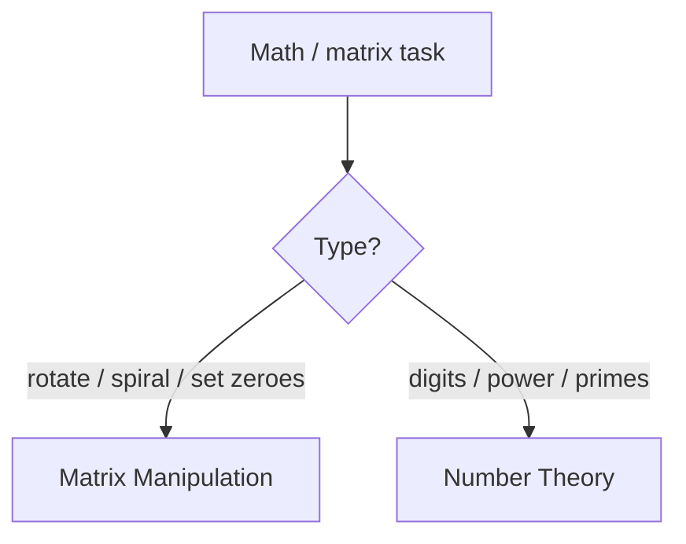

# Math & Geometry - Master Revision Note

Based on the NeetCode roadmap "Math & Geometry" topic.
(NEW topic folder.)

> Company tags are *commonly reported* associations, not official live data.

---

## Visual Decision Tree

---

## Master Decision Table

| If the problem asks for...                                   | Pattern / File |
|--------------------------------------------------------------|----------------|
| Rotate / spiral / transpose / set zeroes on a matrix         | [Matrix_Manipulation_Patterns](./Matrix_Manipulation_Patterns.md) |
| Digit math, powers, primes, base conversion, overflow        | [Number_Theory_Patterns](./Number_Theory_Patterns.md) |

---

## Core Mental Triggers

- **In-place matrix transform** -> think transpose + reverse, or layer-by-layer.
- **"Do it in O(1) space"** on a matrix -> encode markers in first row/column.
- **Fast power / big exponent** -> exponentiation by squaring.
- **Digit reversal / palindrome number** -> `% 10` and `/ 10`, watch overflow.

---

## Files in this folder

1. `Matrix_Manipulation_Patterns.md`
2. `Number_Theory_Patterns.md`
