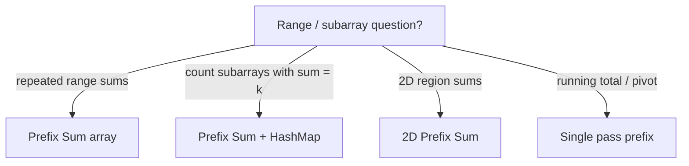

# Prefix Sum - Master Revision Note

AlgoMaster Pattern #1. Precompute cumulative results so range queries become O(1).

> Company tags are *commonly reported* associations, not official live data.

---

## The One Picture

```
 index :   0    1    2    3    4
 nums  : [ 2 ,  4 ,  1 ,  5 ,  3 ]
 prefix: 0   2    6    7   12   15      prefix[i] = nums[0..i-1]
          ^                    ^
          |                    |
 sum(l..r) = prefix[r+1] - prefix[l]
 e.g. sum(1..3) = prefix[4] - prefix[1] = 12 - 2 = 10  ->  (4+1+5)
```

---

## When do I reach for Prefix Sum?



---

## Master Decision Table

| If the problem asks for...                          | File |
|-----------------------------------------------------|------|
| Many range-sum queries on a static array            | [Range_Query_Patterns](./Range_Query_Patterns.md) |
| Count subarrays with sum = k / divisible by k       | [Subarray_Count_Patterns](./Subarray_Count_Patterns.md) |

---

## Files in this folder

1. `Range_Query_Patterns.md`
2. `Subarray_Count_Patterns.md`
