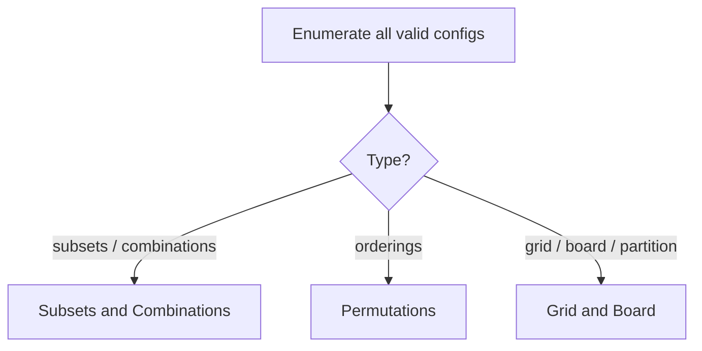

# Backtracking - Master Revision Note

Based on the NeetCode roadmap "Backtracking" topic.

> Company tags are *commonly reported* associations, not official live data.

---

## How to recognise Backtracking

- "Find **all** combinations/permutations/subsets/arrangements."
- "Enumerate every valid configuration" (board, partition, path).
- Constraints that let you **prune** early (invalid -> stop).
- Output is usually a list of lists, not a single number.

If it's "count/optimize" only, DP may be better; if "give me all", backtracking.

---

## Visual Decision Tree



---

## Master Decision Table

| If the problem asks for...                                   | Pattern / File |
|--------------------------------------------------------------|----------------|
| All subsets / combinations / combination sum                 | [Subsets_Combinations_Patterns](./Subsets_Combinations_Patterns.md) |
| All permutations / orderings                                 | [Permutations_Patterns](./Permutations_Patterns.md) |
| Search a grid / place on a board / partition string          | [Grid_Board_Patterns](./Grid_Board_Patterns.md) |

---

## Universal Backtracking Skeleton

```java
void backtrack(State state, List<Result> res) {
    if (isComplete(state)) { res.add(copyOf(state)); return; }
    for (Choice choice : choices(state)) {
        if (!isValid(choice, state)) continue;  // prune
        apply(choice, state);                    // choose
        backtrack(state, res);                   // explore
        undo(choice, state);                     // un-choose (backtrack)
    }
}
```

**The three moves:** choose -> explore -> un-choose.

---

## Complexity note

Backtracking is usually exponential: subsets O(2^n), permutations O(n!).
Pruning and sorting (to skip duplicates) are what make it pass.

---

## Files in this folder

1. `Subsets_Combinations_Patterns.md`
2. `Permutations_Patterns.md`
3. `Grid_Board_Patterns.md`
