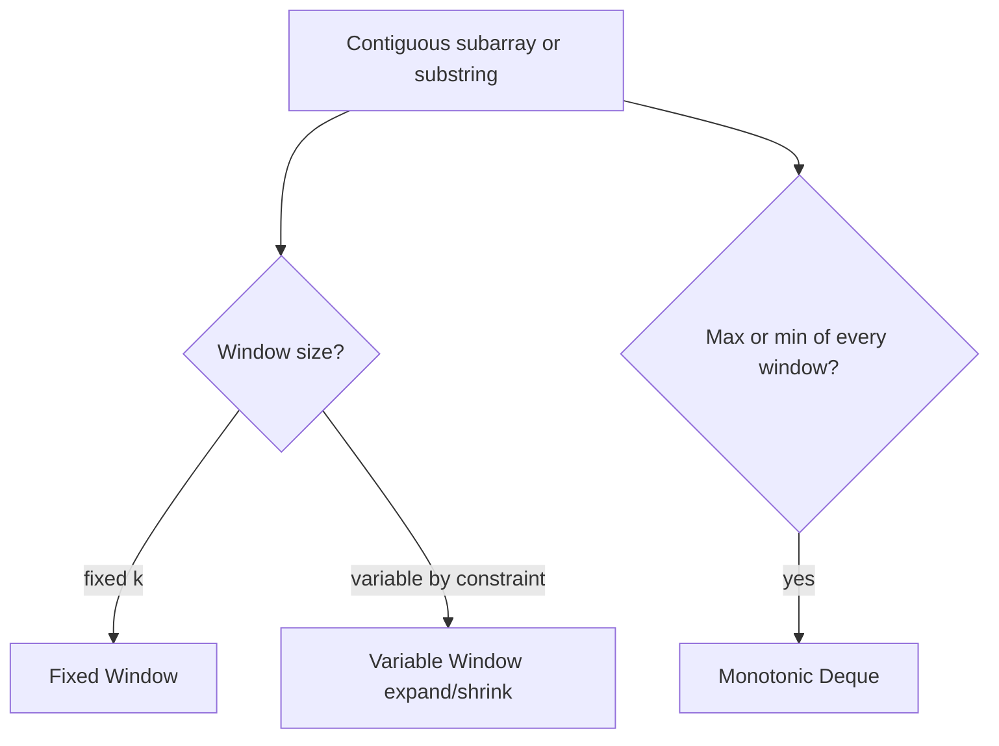

# Sliding Window - Master Revision Note

Based on the NeetCode roadmap "Sliding Window" topic.

> Company tags are *commonly reported* associations, not official live data.

---

## Visual Decision Tree



---

## Master Decision Table

| If the problem asks for...                                        | Pattern / File |
|-------------------------------------------------------------------|----------------|
| Fixed-length window (size k) max/min/avg                          | [Fixed_Window_Patterns](./Fixed_Window_Patterns.md) |
| Longest substring/subarray under a constraint                     | [Variable_Window_Patterns](./Variable_Window_Patterns.md) |
| Shortest subarray meeting a condition (min length)                | [Variable_Window_Patterns](./Variable_Window_Patterns.md) |
| Best single buy/sell, max profit one transaction                  | [Fixed_Window_Patterns](./Fixed_Window_Patterns.md) |
| Window with at most K distinct / permutation / anagram match      | [Variable_Window_Patterns](./Variable_Window_Patterns.md) |
| Max in every window of size k                                     | [Monotonic_Deque_Patterns](./Monotonic_Deque_Patterns.md) |

---

## Core Mental Triggers

- **"Contiguous subarray/substring" + "longest/shortest/max/min"** -> sliding window.
- **Fixed k** -> add right, remove left when window exceeds k.
- **Variable** -> expand right; while invalid, shrink left.
- **"Max/min of each window"** -> monotonic deque.

---

## Universal Variable-Window Skeleton

```java
int left = 0;
for (int right = 0; right < n; right++) {
    // 1. include arr[right] in the window
    while (windowInvalid()) {
        // 2. shrink: remove arr[left], left++
    }
    // 3. window [left..right] is valid -> update answer
}
```

---

## Files in this folder

1. `Fixed_Window_Patterns.md`
2. `Variable_Window_Patterns.md`
3. `Monotonic_Deque_Patterns.md`
