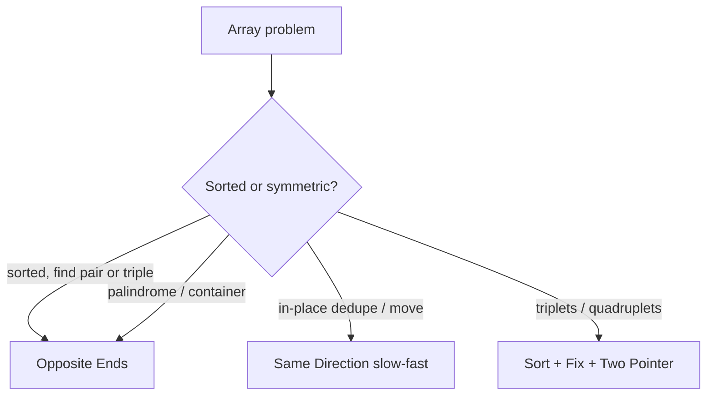

# Two Pointers - Master Revision Note

Based on the NeetCode roadmap "Two Pointers" topic.

> Company tags are *commonly reported* associations, not official live data.

---

## Visual Decision Tree

---

## Master Decision Table

| If the problem asks for...                                     | Pattern / File |
|----------------------------------------------------------------|----------------|
| Sorted array, find pair/triple summing to target              | [Opposite_Ends_Patterns](./Opposite_Ends_Patterns.md) |
| Palindrome check, reverse in place                            | [Opposite_Ends_Patterns](./Opposite_Ends_Patterns.md) |
| Max area / most water / container between two walls           | [Opposite_Ends_Patterns](./Opposite_Ends_Patterns.md) |
| Remove duplicates / move zeroes / partition in place          | [Same_Direction_Patterns](./Same_Direction_Patterns.md) |
| 3Sum / 4Sum / triplets with condition                         | [Three_Sum_Patterns](./Three_Sum_Patterns.md) |
| Trapping rain water                                           | [Opposite_Ends_Patterns](./Opposite_Ends_Patterns.md) |

---

## Core Mental Triggers

- **Array is sorted + looking for a pair** -> two pointers from both ends.
- **In-place rearrange / dedupe** -> slow (write) + fast (read) pointers.
- **"Max/most between two boundaries"** -> shrink from the smaller side.
- **Triplets** -> sort, fix one, two-pointer the rest.

---

## When Two Pointers vs Sliding Window?

- Two Pointers: pointers move based on a **comparison/condition**, often from opposite ends, usually on **sorted** data.
- Sliding Window: a **contiguous window** grows/shrinks to satisfy a constraint (sum/length/distinct).

---

## Files in this folder

1. `Opposite_Ends_Patterns.md`
2. `Same_Direction_Patterns.md`
3. `Three_Sum_Patterns.md`
