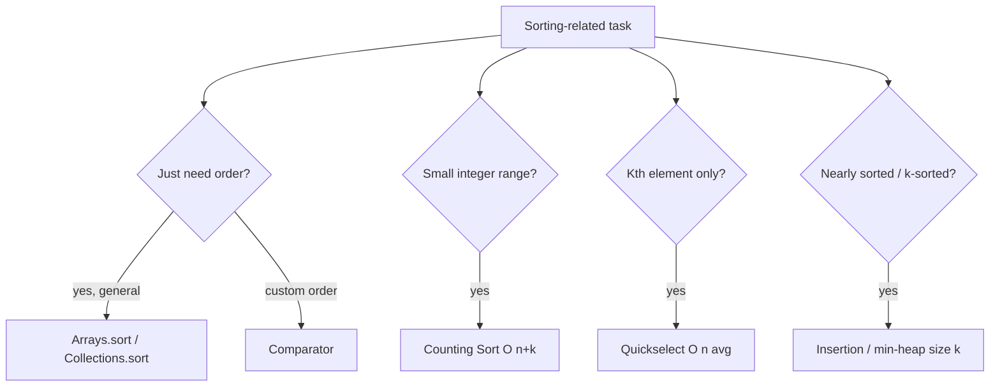

# Sorting - Master Revision Note

Striver A2Z "Sorting" step. Know the trade-offs and when a custom comparator or
counting sort beats a generic sort.

> Company tags are *commonly reported* associations, not official live data.

---

## Algorithm Cheat Sheet (memorize this table)

| Algorithm     | Best     | Average  | Worst    | Space   | Stable | Notes |
|---------------|----------|----------|----------|---------|--------|-------|
| Bubble        | O(n)     | O(n^2)   | O(n^2)   | O(1)    | Yes    | teaching only |
| Selection     | O(n^2)   | O(n^2)   | O(n^2)   | O(1)    | No     | fewest swaps |
| Insertion     | O(n)     | O(n^2)   | O(n^2)   | O(1)    | Yes    | great for nearly-sorted |
| Merge Sort    | O(n log n)| O(n log n)| O(n log n)| O(n)  | Yes    | linked lists, external |
| Quick Sort    | O(n log n)| O(n log n)| O(n^2)  | O(log n)| No     | in-place, cache-friendly |
| Heap Sort     | O(n log n)| O(n log n)| O(n log n)| O(1) | No     | no extra space |
| Counting Sort | O(n+k)   | O(n+k)   | O(n+k)   | O(k)    | Yes    | small integer range |

---

## Which sort / trick?

---

## Files in this folder

1. `Comparator_CustomSort_Patterns.md`
2. `Divide_Conquer_Patterns.md`
