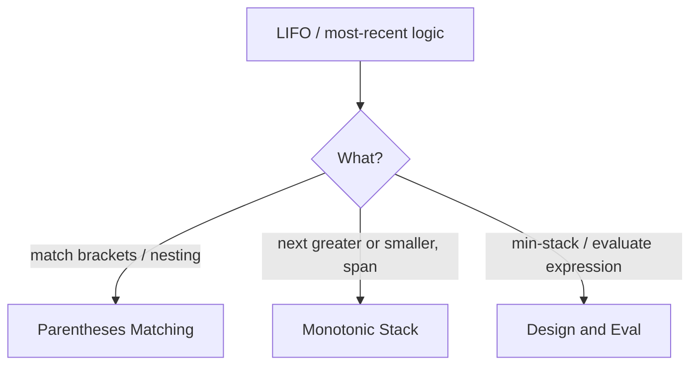

# Stack - Master Revision Note

Based on the NeetCode roadmap "Stack" topic.

> Company tags are *commonly reported* associations, not official live data.

---

## Visual Decision Tree



---

## Master Decision Table

| If the problem asks for...                                      | Pattern / File |
|-----------------------------------------------------------------|----------------|
| Matching brackets, valid parentheses, remove/undo              | [Parentheses_Matching_Patterns](./Parentheses_Matching_Patterns.md) |
| Next/previous greater or smaller element                        | [Monotonic_Stack_Patterns](./Monotonic_Stack_Patterns.md) |
| Daily temperatures, stock span, largest rectangle               | [Monotonic_Stack_Patterns](./Monotonic_Stack_Patterns.md) |
| Design min-stack, evaluate expression (RPN)                     | [Design_And_Eval_Patterns](./Design_And_Eval_Patterns.md) |

---

## Core Mental Triggers

- **"Most recent unmatched" / nesting** -> plain stack (LIFO).
- **"Next greater/smaller"** or **"span"** -> monotonic stack.
- **Evaluate postfix / balance symbols** -> stack of operands/opens.

---

## Monotonic stack skeleton (next greater)

```java
Deque<Integer> st = new ArrayDeque<>();   // stores indices
int[] res = new int[n];
Arrays.fill(res, -1);
for (int i = 0; i < n; i++) {
    while (!st.isEmpty() && nums[i] > nums[st.peek()])
        res[st.pop()] = nums[i];          // nums[i] is next-greater for popped
    st.push(i);
}
```

---

## Files in this folder

1. `Parentheses_Matching_Patterns.md`
2. `Monotonic_Stack_Patterns.md`
3. `Design_And_Eval_Patterns.md`
