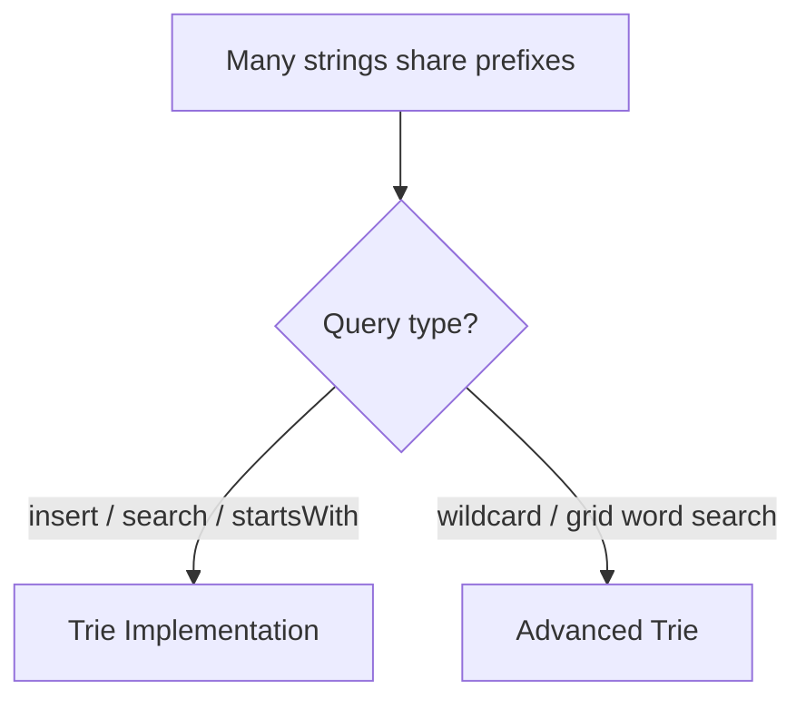

# Tries (Prefix Tree) - Master Revision Note

Based on the NeetCode roadmap "Tries" topic.

> Company tags are *commonly reported* associations, not official live data.

---

## How to recognise a Trie

- "Prefix", "starts with", "autocomplete", "dictionary".
- Many string lookups sharing common prefixes.
- Word search / matching over a set of words (pair with backtracking).

---

## Visual Decision Tree



---

## Master Decision Table

| If the problem asks for...                                   | Pattern / File |
|--------------------------------------------------------------|----------------|
| Insert / search / startsWith over words                      | [Trie_Implementation_Patterns](./Trie_Implementation_Patterns.md) |
| Wildcard search, word search in grid, prefix aggregation     | [Trie_Advanced_Patterns](./Trie_Advanced_Patterns.md) |

---

## Core Node structure

```java
class TrieNode {
    TrieNode[] children = new TrieNode[26];
    boolean isEnd;
}
```

- Each level = one character. Path from root spells a prefix.
- `isEnd` marks a complete word.
- Insert/search/startsWith are all O(word length).

---

## Files in this folder

1. `Trie_Implementation_Patterns.md`
2. `Trie_Advanced_Patterns.md`
